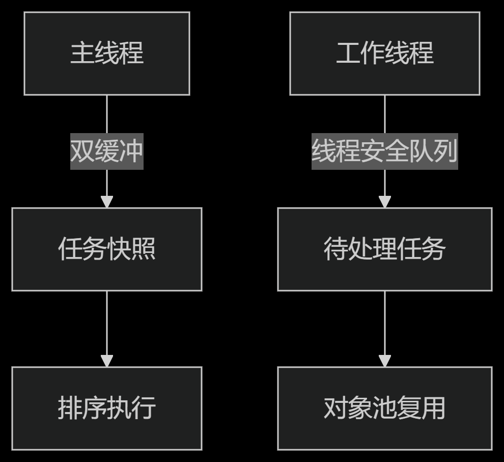

# Timer - Unity定时任务调度系统


## 目录
- [核心特性](#核心特性)
- [时间源类型](#时间源类型)
- [快速开始](#快速开始)
- [API说明](#api说明)
  - [创建定时任务](#1-创建定时任务)
  - [查找定时任务](#2-查找定时任务)
  - [终止定时任务](#3-终止定时任务)
- [内部机制](#4-内部机制)
- [注意事项](#5-注意事项)
- [示例代码](#示例代码)
- [扩展建议](#扩展建议)
- [下载安装](#下载与安装)

## 核心特性

| 特性 | 描述 |
|------|------|
| 多时间源支持 | 支持GameTime/UnscaledTime/RealTime |
| 对象池优化 | 避免GC，提升性能 |
| 线程安全 | 支持多线程添加/移除任务 |
| 任务查找 | 支持ID/回调/目标对象多种查找方式 |
| 生命周期 | 自动初始化，独立于场景生命周期 |

## 时间源类型

```csharp
public enum TimerTimeSource {
    GameTime,      // Time.time (受时间缩放影响)
    UnscaledTime,  // Time.unscaledTime (不受时间缩放影响)
    RealTime       // DateTimeOffset.UtcNow (系统真实时间)
}
```
# 快速开始
## 基础用法
```csharp
// 延迟执行
Timer.Delay(3f, () => Debug.Log("3秒后执行"));

// 循环执行（无限循环）
Timer.Loop(1f, () => Debug.Log("每秒执行"));

// 带参数的循环任务
Timer.Loop(2f, () => Attack(target), times: 5);
```

# API说明
## 1. 创建定时任务
Timer.Delay
```csharp
static long Delay(
    float delay, 
    Action callback, 
    TimerTimeSource timeSource = TimerTimeSource.GameTime
)
```
- 功能：单次延迟执行

- 参数：

    - delay：延迟时间(秒)

    - callback：无参回调方法

    - timeSource：时间源类型

**Timer.Loop**
```csharp
static long Loop(
    float interval,
    Action callback,
    TimerTimeSource timeSource = TimerTimeSource.GameTime,
    bool immediate = false,
    int times = 0
)
```
 - 参数：

     - immediate：是否立即执行第一次

     - times：执行次数(0=无限循环)


## 2. 查找定时任务

| 方法签名             | 返回类型         | 说明                          |
|----------------------|------------------|-------------------------------|
| `Find(long id)`      | `TimerTask`      | 通过任务ID查找特定定时任务     |
| `Find(Action func)`  | `List<TimerTask>`| 查找使用相同回调的所有定时任务 |
| `Find(object target)`| `List<TimerTask>`| 查找对象关联的所有定时任务     |

## 3. 终止定时任务方法

| 方法签名             | 说明                          |
|----------------------|-------------------------------|
| `Kill(long id)`      | 终止指定ID的单个定时任务       |
| `Kill(Action func)`  | 终止所有使用该回调的定时任务   |
| `Kill(object target)`| 终止对象关联的所有定时任务     |
| `KillAll()`          | 终止所有定时任务               |
`` `
## 4. 内部机制
**架构设计**


**关键优化**
- 对象池：ConcurrentQueue实现任务复用

- 双缓冲：避免遍历时修改冲突

- 自动排序：按执行时间排序插入

## 5.  注意事项
**最佳实践**
### 1. 避免在lambda中捕获复杂对象

```csharp
// 不推荐
Timer.Delay(1f, () => Destroy(complexObj));

// 推荐
Timer.Delay(1f, DestroySimple);
```

### 2. RealTime使用场景：

 - 后台计时

 - 网络超时检测

 - 需要跨暂停的场景

# 示例代码
## 完整使用案例
```csharp
public class Player : MonoBehaviour 
{
    private long _attackTimer;

    void Start() {
        // 5秒后开始攻击
        _attackTimer = Timer.Delay(5f, StartAttack);
    }

    void StartAttack() {
        // 每2秒攻击一次，共3次
        Timer.Loop(2f, Attack, times: 3);
    }

    void Attack() {
        Debug.Log("发动攻击！");
    }

    void OnDestroy() {
        Timer.Kill(this); // 清理所有关联任务
    }
}
```

# 扩展建议
## 推荐扩展方向
1. 协程支持：

```csharp
Timer.DelayCoroutine(1f, MyCoroutine);
```
2. 参数化回调：

```csharp
Timer.Delay(1f, (arg) => {}, "参数");
```
## 下载与安装
### 安装方式
 - 1. 通过GitURL安装：
    https://github.com/badApple001/Timer.git

 - 2. 或导入UnityPackage：
[下载链接](./Release/Timer.unitypackage)

 - 3. 单元测试案例
 [下载链接](./Release//TimerTest.unitypackage)

## 技术支持
- 联系作者：Isysprey@foxmail.com
- 文档版本：v2.1.0