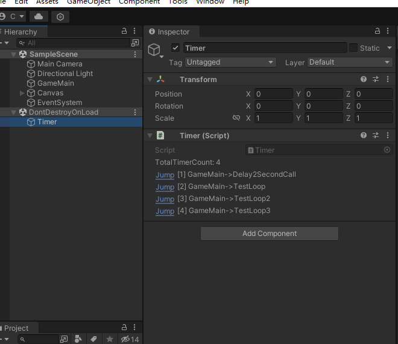
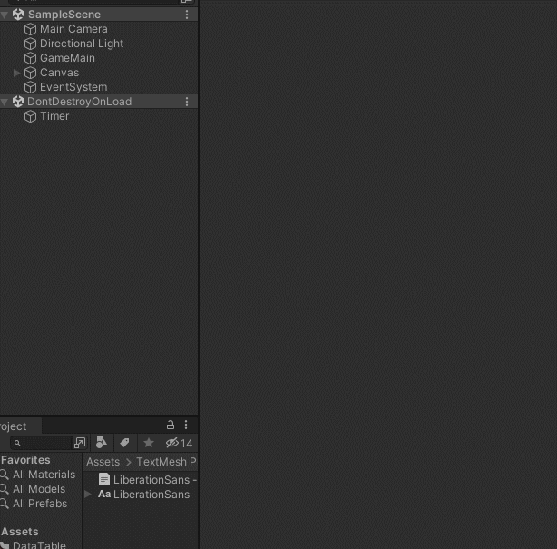
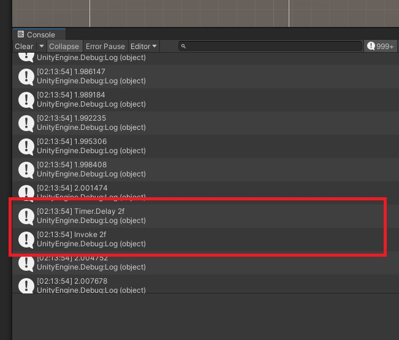
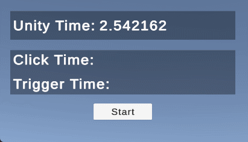
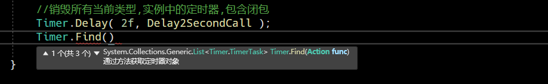

# 使用方法
> 如果您觉得好用记得给我点个小星星
本插件集高效,精准,轻量,实用定时器为一体,希望它能使你的代码更加优雅

## 运行面板
运行面板随着Unity运行 自动挂载 仅运行在Editor模式下 不会影响额外性能

### 定时运行时 会显示当前定时器的调度信息



### 同时,你可以点击定时器的调度信息,追踪跳转到指定方法行
该功能主要实现了 能从Unity面板跳转到对应方法位置



## 与Unity内部定时器Invoke高度一致


## 开箱即用 导入UnityPackage
[下载UnityPackage](https://github.com/badApple001/Timer/releases/tag/1.0)


## 食用案例

### 创建定时器
```csharp
//每秒执行一次,UpdatePerSeconds方法,是否立即执行?,执行次数?
Timer.Loop( 1f, UpdatePerSeconds, true, 5 );
```


```csharp
//循环执行 永久
Timer.Loop( 1f, UpdateDateTime );
```


```csharp
//延时2秒执行 精准度测试 
Timer.Delay( 2f, Delay2SecondCall );
```



### 销毁定时器
```csharp
//通过TimerId清理
ulong timerId = Timer.Delay( 2f, Delay2SecondCall );
Timer.Kill( timerId );

//通过注册方法销毁
Timer.Delay( 2f, Delay2SecondCall );
Timer.Kill( Delay2SecondCall );

//销毁当前类注册的所有定时器
Timer.Delay( 2f, Delay2SecondCall );
Timer.Kill( this );

//销毁所有当前类型,实例中的定时器,包含闭包
Timer.Delay( 2f, Delay2SecondCall );
Timer.Kill<T> ();
```


### Find定时器

