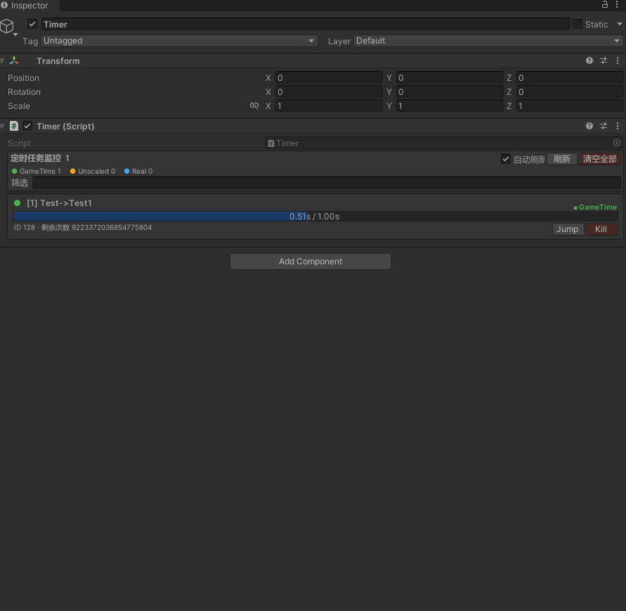

# Timer — Unity 定时任务管理工具


一个轻量、零配置的 Unity 定时器插件：支持一次性延迟任务与循环任务，提供三种时间源，内置对象池，并附带编辑器可视化调试面板。

- **Author**: ChenJC
- **Feedback**: Isysprey@foxmail.com
- **参考**: https://blog.csdn.net/qq_39162566/article/details/113105351

## 特性

- ⏱ **三种时间源**：游戏时间（受 timeScale 影响）、非缩放时间、真实世界时间（UTC）
- 🔁 **一次性 / 循环 / 限次循环**：`Delay` 与 `Loop` 两个入口覆盖所有场景
- 🧹 **灵活的清理方式**：按 ID、按回调、按目标对象、按类型、一键清空
- ♻ **对象池复用**：`TimerTask` 回收复用，减少 GC 压力
- 🧵 **分平台实现**：普通平台支持多线程注册/取消；WebGL / 微信小游戏走单线程精简版
- 🖥 **可视化调试面板**：Play 模式下实时查看任务列表、触发进度，支持跳转源码与单个 Kill
- ✅ **明确的语义保证**：同帧注册的任务触发顺序为 FIFO；回调异常不会中断其他任务

## 文件结构

```
Timer/
├── Timer.cs           // 核心定时器（运行时，自动初始化，无需手动挂载）
├── TimerInspector.cs  // 编辑器可视化面板（仅 Editor 下生效）
└── README.md
```

## 环境要求

- Unity **2021.2** 及以上（WebGL 分支依赖 .NET Standard 2.1 的 `Queue.TryDequeue` / `Stack.TryPop`）
- 无需任何第三方依赖

## 快速开始

**零配置**：插件通过 `[RuntimeInitializeOnLoadMethod(BeforeSceneLoad)]` 自动初始化，会在启动时创建一个名为 `Timer` 的 `DontDestroyOnLoad` 全局对象，直接使用静态 API 即可。

```csharp
using UnityEngine;

public class Demo : MonoBehaviour
{
    private void Start()
    {
        // 3 秒后执行一次
        Timer.Delay(3f, OnSkillReady);

        // 每 2 秒执行一次，无限循环
        Timer.Loop(2f, RegenerateHP);

        // 每 1 秒执行一次，共 5 次
        Timer.Loop(1f, Countdown, Timer.TimerTimeSource.GameTime, 5);
    }

    private void OnSkillReady() { /* ... */ }
    private void RegenerateHP() { /* ... */ }
    private void Countdown()    { /* ... */ }

    // 对象销毁时，清理它注册的所有定时器
    private void OnDestroy() => Timer.Kill(this);
}
```

## API 一览

### 注册任务

| 方法 | 说明 |
|---|---|
| `long Delay(float delay, Action func, TimerTimeSource src = GameTime)` | 延迟 `delay` 秒后执行**一次** |
| `long Loop(float interval, Action func, TimerTimeSource src = GameTime, int times = 0)` | 每 `interval` 秒执行一次；`times = 0` 表示无限循环 |

返回值是任务的**唯一 ID**（用于后续 `Kill` / `Find`）；参数非法（`func` 为 null、`interval < 0`）时返回 `-1` 并打印错误。

### 时间源 `TimerTimeSource`

| 枚举值 | 基准 | 适用场景 |
|---|---|---|
| `GameTime`（默认） | `Time.time`，受 timeScale 影响 | 常规游戏逻辑（暂停时跟着停） |
| `UnscaledTime` | `Time.unscaledTime`，不受 timeScale 影响 | 慢动作/暂停菜单中的 UI 计时 |
| `RealTime` | UTC 真实时间（秒，`double`） | 心跳、防作弊计时等与游戏逻辑无关的精确计时 |

### 查询任务

| 方法 | 说明 |
|---|---|
| `TimerTask Find(long ID)` | 按 ID 查询，返回**快照副本**，未找到返回 null |
| `List<TimerTask> Find(Action func)` | 按回调查询 |
| `List<TimerTask> Find(object target)` | 按回调所属对象查询 |

> ⚠ `Find` 返回的是**只读快照副本**：对它调用 `Cancel()` 无效（会打印警告）。取消任务请使用 `Timer.Kill(ID)`。快照上的 `IsActive()`、`GetTimeUntilNextExecution()` 可用于读取状态。

### 取消任务

| 方法 | 说明 |
|---|---|
| `Kill(long ID)` | 按 ID 取消 |
| `Kill(Action func)` | 取消该回调对应的所有任务 |
| `Kill(object target)` | 取消该对象所有成员方法注册的任务（常用于 `OnDestroy` 中 `Kill(this)`） |
| `Kill<T>()` | 取消类型 `T`（含其嵌套类/闭包）注册的所有任务 |
| `KillAll()` | 清空所有任务（下一帧生效） |

### 帧缓存时间

```csharp
float  t1 = Timer.GameTime;      // 当前帧 Time.time
float  t2 = Timer.UnscaledTime;  // 当前帧 Time.unscaledTime
double t3 = Timer.RealTime;      // 当前帧 UTC 秒（double）
```

## 语义保证

- **FIFO 顺序**：同一帧内注册的多个任务若在同一帧到期，触发顺序与注册顺序一致。
- **`Delay(0)`**：语义为"**下一帧触发**"，不是当前帧立即执行。
- **异常隔离**：某个任务回调抛异常只会打印 `LogError`，不影响同帧其他任务，也不会中断定时器系统。
- **每帧一次**：循环任务每帧最多触发一次；`interval` 小于帧间隔时等同于每帧触发，不会补帧。
- **回调内操作安全**：在回调中注册/取消任务都是安全的，统一在下一帧生效。

## 可视化调试面板

Play 模式下选中场景中的 **`Timer`** 对象（位于 DontDestroyOnLoad 场景），Inspector 会显示实时监控面板：

- **头部**：任务总数、按时间源分类统计、名称筛选框、`自动刷新` 开关（0.25s 间隔）、`清空全部`
- **任务卡片**（按剩余触发时间升序）：
  - 状态点（绿 = 激活，灰 = 已取消）+ 回调名 + 时间源彩色徽标
  - 触发**进度条**（剩余时间 / 间隔）
  - ID、剩余次数（无限循环显示 ∞）
  - `Jump`：跳转到回调方法源码（lambda 自动定位到外层方法；带命名空间的类也支持）
  - `Kill`：直接取消该任务

## 平台差异

| | 普通平台（PC / 移动 / 主机） | WebGL / 微信小游戏 |
|---|---|---|
| 线程模型 | 支持多线程注册/Find/Kill（ConcurrentQueue + 快照双缓冲） | 单线程精简实现 |
| 任务池 | `ConcurrentQueue` | `Stack` |
| 触发逻辑 | 完全一致 | 完全一致 |

> 多线程版本下，`Find`/`Kill` 可以从子线程安全调用；任务回调永远在主线程 `Update` 中执行。

## 最佳实践

1. **优先使用类成员方法注册**，慎用 lambda：
   ```csharp
   Timer.Delay(1f, this.CloseDoor);   // ✅ 可被 Kill(this) 匹配
   Timer.Delay(1f, () => CloseDoor()); // ⚠ 闭包，Kill(this) 匹配不到（注册时会有警告）
   ```
2. **对象销毁时清理**：在 `OnDestroy` 中调用 `Timer.Kill(this)`，避免回调打到已销毁对象。
3. **取消用 ID**：`Find(id).Cancel()` 是无效的（快照副本），请使用 `Timer.Kill(id)`。
4. **回调要轻**：所有回调在主线程 `Update` 中串行执行，耗时操作会拖慢整帧。

## 更新日志

### 2026-07 重构

- 修复：同帧多个循环任务到期时每帧只触发一个的问题（现同帧全部触发）
- 修复：混合时间源在暂停（timeScale = 0）时互相阻塞的问题（执行改为全量扫描，不再依赖排序）
- 修复：多线程下同一任务可能被重复回收进对象池的问题（原子化 `Cancel`）
- 修复：`Find` 返回副本上调 `Cancel` 静默无效（现会警告提示）
- 新增：`Loop` 参数校验、闭包 lambda 注册警告、`Init` 完整清理
- Inspector 全面重做：进度条 / 筛选 / 自动刷新 / Kill 按钮；修复 Jump 对带命名空间类失效、行号定位不准等问题
